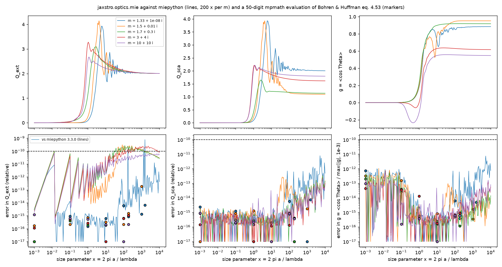

# optics.mie — Mie scattering by homogeneous spheres

Claim: `jaxstro.optics.mie.mie_efficiencies` gives Q_ext, Q_sca, Q_abs and g = ⟨cos Θ⟩
for refractive indices from weakly absorbing dielectrics (1.33 + 1e-8 i) to metal-like
(10 + 10 i) over size parameters x ∈ [1e-3, 1e4] to the tolerance agreed on 2026-10-04:
relative error ≤ 1e-10 in Q_ext and Q_sca, |Δg| ≤ 1e-10 max(|g|, 1e-3).

## References (run by us)

- A 50-digit evaluation of Bohren & Huffman (1983) eq. 4.53 with mpmath (Riccati–Bessel
  functions from J and Y of half-integer order, no recurrences), summed 10 terms beyond
  x + 4.05 x^{1/3} + 2 (20 more terms change Q_ext by < 1.4e-15). The reference for the
  tolerance.
- miepython 3.3.0 over 5 m × 200 log-spaced x: a cross-check of the whole domain. For
  |m| x < 0.1 miepython switches to a small-sphere approximation; there the series from
  its own Mie coefficients is used. miepython truncates its series at x + 4.05 x^{1/3} + 2
  terms, which limits its Q_ext for weakly absorbing large spheres.

Data: `tests/validation/data/optics/` (built by `scripts/build_mie_reference.py`); test:
`tests/validation/test_optics_mie_reference.py`; figure: `figures/optics-mie.png`
(`scripts/plot_mie_validation.py`).

## Results (2026-10-04)

| Comparison | Q_ext | Q_sca | g (\|Δg\| / max(\|g\|, 1e-3)) |
|---|---|---|---|
| 50-digit mpmath, 33 cases (5 m; x = 1e-3, 0.1, 1, 10, 100, 189; x = 1000, 1552 for the weakly absorbing m) | ≤ 1.9e-13 | ≤ 5.8e-15 | ≤ 7.3e-13 |
| 50-digit mpmath at zeros of ψ_n(x), n < x (x = π, 2π, 10π, first zeros of ψ_1 and ψ_5; 3 m), 15 cases | ≤ 4.4e-16 | ≤ 6.7e-16 | ≤ 6.7e-16 |
| miepython 3.3.0, 1000 cases | ≤ 7.8e-10 (miepython's truncation; at x = 1552 the 50-digit value gives jaxstro 7.4e-15, miepython 7.8e-10) | ≤ 7.9e-12 | ≤ 7.5e-12 |

The miepython Q_ext differences have a sawtooth in x that resets where miepython's integer
term count steps up, the signature of truncation. Derivatives: reverse and forward mode
agree to 8e-17; AD against central differences in n, k, x to 4.7e-8 (step 1e-6)
(`tests/unit/test_optics_mie.py`). Limits: Rayleigh Q_abs and Q_sca to O(x²), Q_ext → 2 at
large x.

## Corrections to BHMIE found by the comparison

| Issue | Measured effect | Change |
|---|---|---|
| D_n downward recurrence started at max(N_stop, \|m x\|) + 15 | Q_ext off by up to 9.7e-4 for m = 1.33 + 1e-8 i at large x | start + 2 √\|m x\| |
| ψ_n by upward recurrence | cancels for n > x: g off by 3.8e-4 at x = 1e-3 | ψ_n from the downward ratio ψ_n/ψ_{n−1} for n > ⌊x⌋ (next row) |
| series truncated at Wiscombe's x + 4 x^{1/3} + 2 | Q_ext depends linearly on the tail: off by up to 3.9e-10 (m = 1.5 + 0.01 i, x = 189) | 12 more terms; 4.9e-15 against the 50-digit reference |
| ψ_n(x) from downward ratios for every n (the 2026-10-04 version of the previous row) | at zeros of ψ_{n−1} with n < x the ratio diverges and ψ_n loses all precision: Q_sca 48 % high at x = 2π; found 2026-10-05 by comparison with Draine's suvSil_81 table, whose grid puts a = λ (x = 2π) at every radius | upward recurrence for n ≤ ⌊x⌋ (stable there), downward ratio for n > ⌊x⌋ (no zeros); 6.7e-16 at the zeros |
